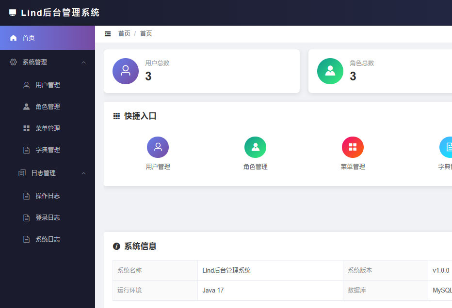
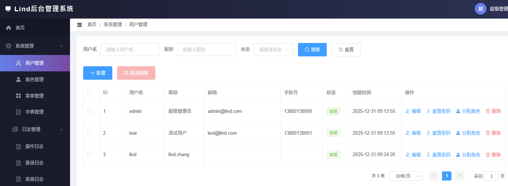
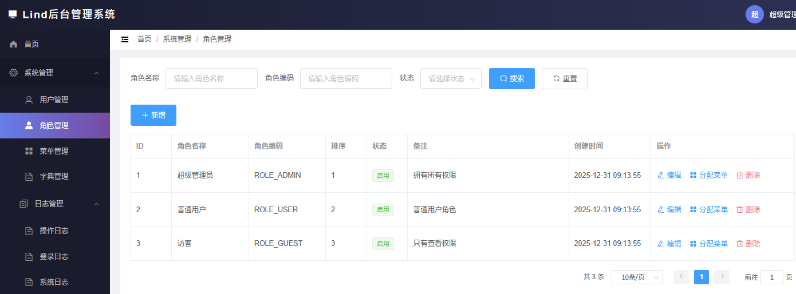
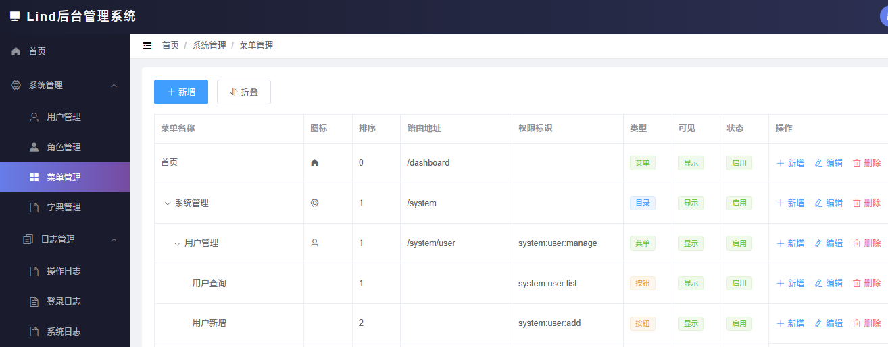
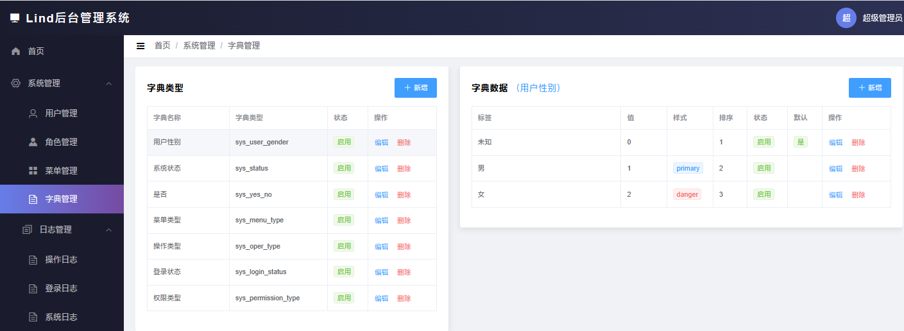
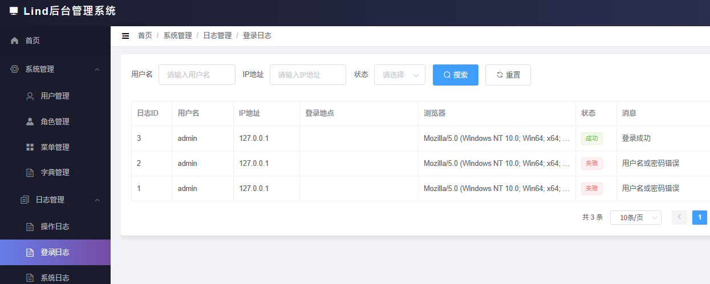

# Lind后台管理系统
## 功能描述
* 后端管理系统，包含用户管理，角色管理，权限管理，菜单管理等功能模块
* 支持动态权限分配，基于角色的访问控制
* 支持数据字典管理，系统日志查看等常用后台功能
* 提供友好的用户界面，支持数据的增删改查操作
* 支持多语言切换，满足不同地区用户需求
* 响应式设计，适配不同设备和屏幕尺寸

## 数据库
* mysql地址:localhost:3306
* 帐号:root
* 密码:123456
数据库采用mysql，你需要帮我添加数据库和相关数据表，编码是utf8mb4，排序规则是utf8mb4_general_ci，数据库名称是lind_admin，数据表如下：
1. 用户表（users）
2. 角色表（roles）
3. 权限表（permissions）
4. 菜单表（menus）
5. 用户角色关联表（user_roles）
6. 角色权限关联表（role_permissions）
7. 数据字典表（data_dictionaries）
8. 系统日志表（system_logs）
9. 操作日志表（operation_logs）
10. 登录日志表（login_logs）

## 技术栈
* 架构模式：前后不分离，通过freemarker模板引擎渲染页面,页面上引用vue.js等前端框架实现动态交互效果，有统一的页面模板
* 前端：freemarker + Vue.js + Element UI
* 后端：Spring Boot + Spring Security + JPA + MySQL + Redis

## 使用步骤
添加依赖
```
<dependency>
    <groupId>com.lind</groupId>
    <artifactId>lind-admin</artifactId>
    <version>0.0.1</version>
</dependency>
```
配置数据库连接
```
spring:  
  datasource:
    driver-class-name: com.mysql.cj.jdbc.Driver
    url: jdbc:mysql://localhost:3306/lind_admin?useUnicode=true&characterEncoding=utf8&useSSL=false&serverTimezone=Asia/Shanghai&allowPublicKeyRetrieval=true
    username: root
    password: "123456"
```
## 系统截图
系统首页


用户管理


角色管理


菜单管理


数据字典


操作日志

